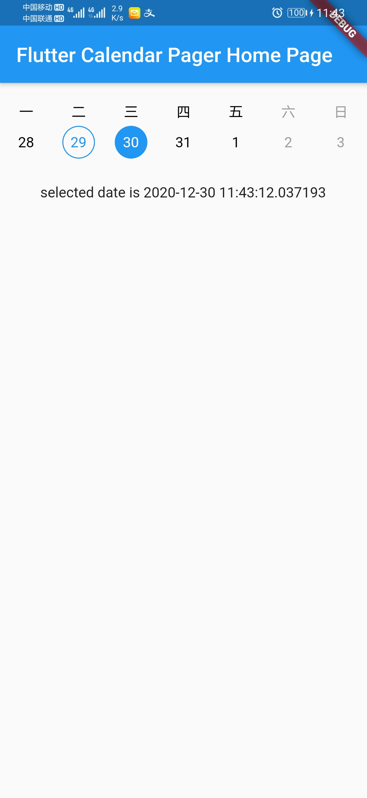

# flutter_calendar_pager

* 日历滚动组件

[变更历史](CHANGELOG.md)

## 效果

## 使用

### Use this package as a library

### 1. Depend on it

Add this to your package's pubspec.yaml file:

    dependencies:
        flutter_calendar_pager: ^0.0.1

### 2. Install it

You can install packages from the command line:

with pub:

    $ pub get

with Flutter:

    $ flutter pub get

Alternatively, your editor might support pub get or flutter pub get. Check the docs for your editor to learn more.

### 3. Import it

Now in your Dart code, you can use:

    import 'package:flutter_calendar_pager/flutter_calendar_pager.dart';